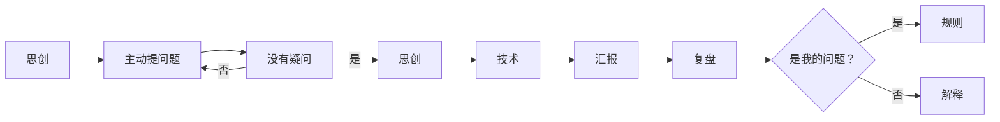

# 技能流程

 

```mermaid
graph LR
    A[思创] --> B[主动提问题]
    B --> C[没有疑问]
    C --> |是| D
    C --> |否| B
    D[思创] --> E[技术]
    E --> F[汇报]
    F --> G[复盘]
    G --> H{是我的问题？}
    H -->|是| I[规则]
    H -->|否| J[解释]
```
以上是示例技能流程，具体实现根据产品需求和用户场景进行调整，可以自己创作和修改