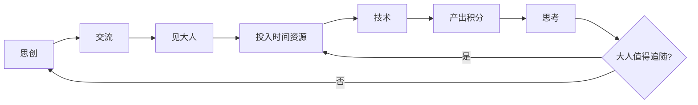
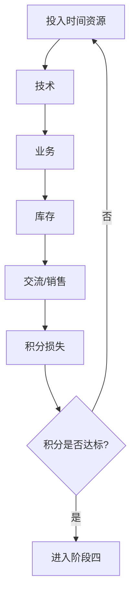
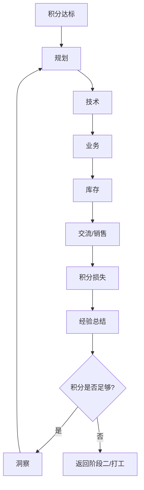

# 运作流程

<br />

## 乾流程

### 阶段一：潜龙勿用

```
洞察
```

### 阶段二：利见大人



### 阶段三：终日乾乾



### 阶段四：或跃在渊



### 阶段五：飞龙在天

```mermaid
graph TD
    A[积分达到理想状态] --> B[经验总结]
    B --> C[梳理理念]
    C --> D[梳理制度]
    D --> E[打造SOP]
    E --> F[定期洞察]
    F --> G[考察风险]
    G --> H[考察竞争情况]
    H --> I{是否需要调整?}
    I -->|是| J[进入第一阶段/洞察]
    I -->|否| F
```



## 坤流程

### 履霜坚冰至

预判，将集体数据向量化提升洞察和预判能力

### 直方大

吸引人才，提供平台、创造机会而不是自己去做，去人才大厅招募人才

### 含章可贞

即使有能力也不表现出来

### 无咎无誉

功劳给付出的人，不能只顾自己，舍得分钱

### 黄裳元吉

赏罚分明、管理有度、调配合理、沟通到位

### 龙战于野

不能膨胀，觉得自己很行，要保持小心谨慎、低调